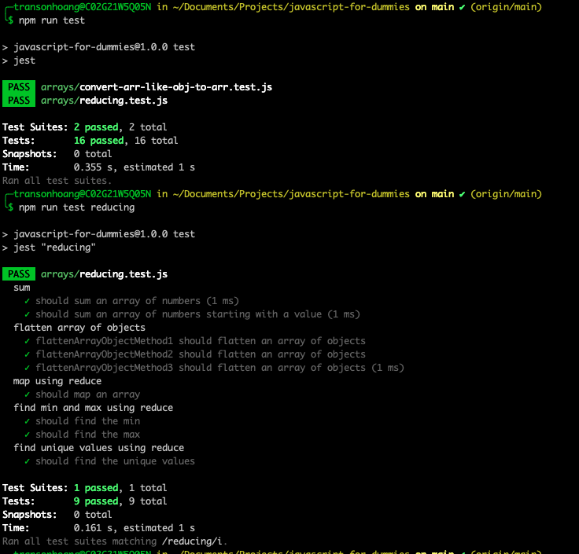

# Javascript for Dummies

## Tech Stacks

- Jestjs for unit test https://jestjs.io/

## Installation

- run `git clone https://github.com/coderschoolmentee/javascript-for-dummies.git`
- run `cd javascript-for-dummies`
- run `npm i`
- run `npm run test` and enjoy

## Exercises

- Arrays
  - Convert Array Like Object to Array
  - Reducing
  - Mapping value
